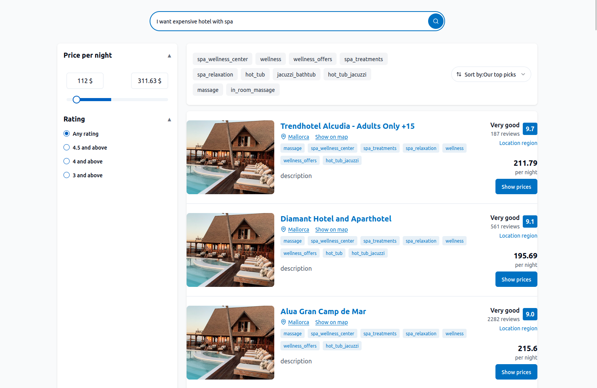
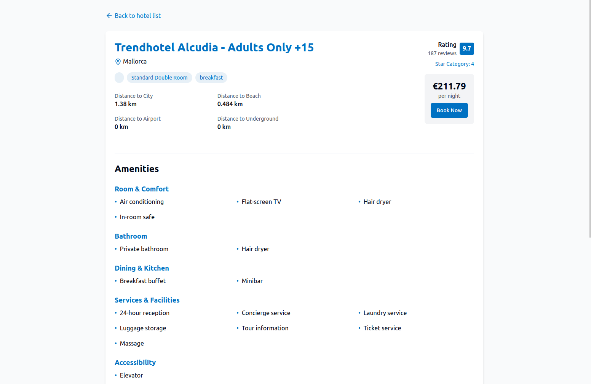

# checkedin24-AI-hotel-search-frontend

A modern, AI-powered hotel search frontend built with Vite, React, TypeScript, and shadcn-ui. Effortlessly find the perfect hotel with a beautiful, responsive UI and seamless user experience.

---

## 🚀 Features

- 🔍 **AI-Powered Hotel Search:** Find hotels quickly and intelligently.
- 💡 **Modern UI:** Built with shadcn-ui and Tailwind CSS for a sleek, responsive design.
- ⚡ **Fast & Lightweight:** Powered by Vite for instant development and lightning-fast builds.
- 🛠️ **TypeScript Support:** Type-safe codebase for reliability and maintainability.
- 📱 **Mobile Friendly:** Fully responsive for all devices.

---

## 🖼️ Screenshots



<details>
<summary>Main page screenshot</summary>

</details>



<details>
<summary>Hotel details screenshot</summary>

</details>

---

## 🛠️ Tech Stack

- [Vite](https://vitejs.dev/)
- [React](https://react.dev/)
- [TypeScript](https://www.typescriptlang.org/)
- [shadcn-ui](https://ui.shadcn.com/)
- [Tailwind CSS](https://tailwindcss.com/)

---

## 🚦 Getting Started

Clone the repository and get up and running in minutes:

```sh
# 1. Clone the repository
git clone https://github.com/EgorcaA/checkedin24-AI-hotel-search-frontend.git

# 3. Install dependencies
npm install

# 4. Start the development server
npm run dev
```

Visit the app at: [https://checkedin24-aihotelsearch.vercel.app/](https://checkedin24-aihotelsearch.vercel.app/)

## 📄 License

This project is licensed under the MIT License. See the [LICENSE](LICENSE) file for details.

---

## 📬 Contact

For questions, feedback, or support, please open an issue or contact the maintainer.

---
